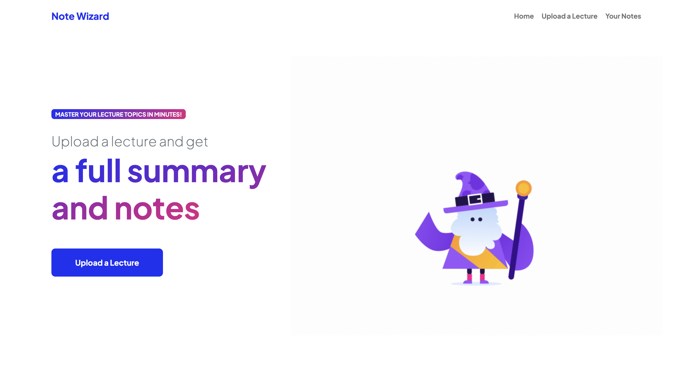

# NoteWizard
NoteWizard transforms online lectures into efficient summaries and notes using IBM Watson STT and OpenAI's GPT models. Streamlining learning, it saves students time while enhancing their online course experience.

NoteWizard is an LLM-backed web app that allows students to upload recorded lectures and automatically receive comprehensive summaries and notes, saving them hours of time & effort.

Built with: Python (Flask), HTML, CSS (Bootstrap), IBM Watson Speech-to-Text API, OpenAI API

